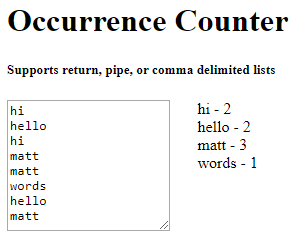

I needed to take a large list of usernames that were return delimited and count how many times each one showed up in that list. Took me about 10 minutes do it manually the first time and after I was asked to do it again I had to write something to make it easier. I couldn't find something that already existed, so I created something. Presenting [Occurrence Counter](https://mrbusche.com/p/oc/)! Simply paste in a return, comma, or pipe delimited list of strings and it will show you how many times each item was in the list. I've put this over on [Github](https://github.com/mrbusche/occurrenceCounter) in case anyone has any issues or features requests.

