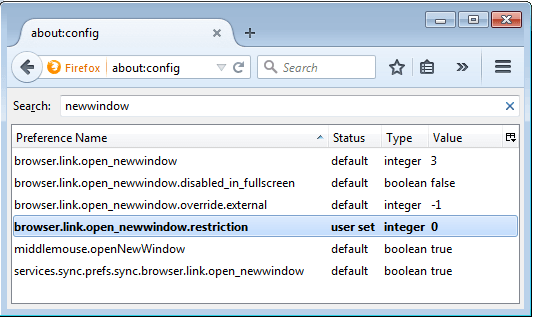

We have an application at work that was built for IE 5.5, so this may have made sense at some point, but it opens up 3 new windows before you actually get to the useful part of the application. In Chrome you can right click on the title bar and choose &#8220;Show as Tab&#8221;, but Firefox doesn't have that option. Thankfully there's an about:config setting you can change to force all pop ups to render into a tab rather than a new window.

If you're not familiar with about:config simply type about:config into the address bar and hit go, just like it's a normal url. You will likely get a warning about &#8220;voiding your warranty&#8221;. Click &#8220;I'll be careful, I promise!&#8221; and the search for newwindow. You will see an entry with a Preference Name of &#8220;browser.link.open_newwindow.restriction&#8221; and a value of 2. Change that value to 0 and all pop ups will open as tabs.

 
