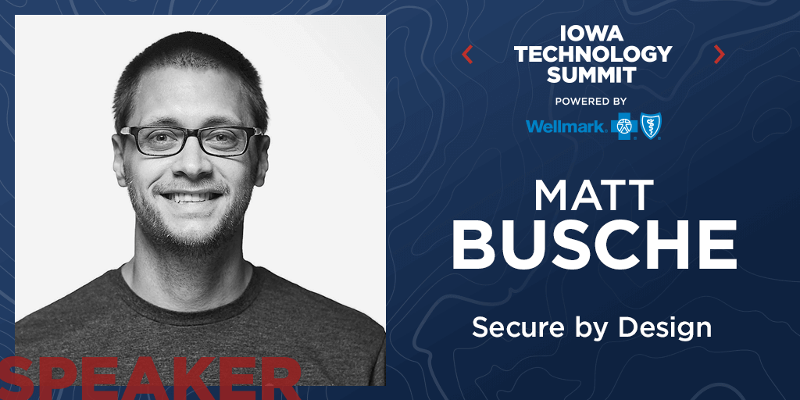

I'm proud to announce I'll be speaking at [Iowa Technology Summit](https://www.technologyiowa.org/) on October 2nd! The conference will be held at the Community Choice Credit Union Convention Center in down Des Moines.

I'll be speaking on Secure by Design and how you can ensure security throughout development of your application. I'll cover some of the OWASP top 10, best practices, and things I've implemented at work. I gave a similar talk at DevOpsDays Des Moines, but I have a lot of takeaways from that talk and my team at work has made a lot of progress that I'm excited to be able to share.

[Registration](https://www.eventbrite.com/e/iowa-technology-summit-powered-by-wellmark-registration-45898842674?aff=es2) is open now, so don't delay in getting your tickets!

