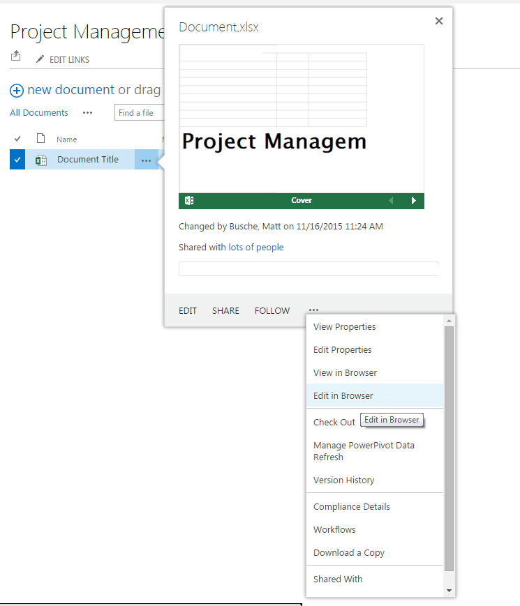

If you're like most people you don't use Internet Explorer for any of your web browsing needs unless you're required to. Thankfully most websites are compatible with most browsers and those instances are few and far between. If you use Sharepoint though, you know most activities function much better when you use Internet Explorer and some functionality is not available.

For example if you want to edit a document clicking the EDIT button gives you an error saying it cannot find the appropriate program to edit with. Thankfully I stumbled across an &#8220;edit in browser&#8221; option. When viewing a document click on the &#8220;&#8230;&#8221; which brings up a pop up. From there click on &#8220;&#8230;&#8221; again and you will see an Edit in Browser option. Not all functionality is available when you do this, but for most quick edits this will work excellent.

 
