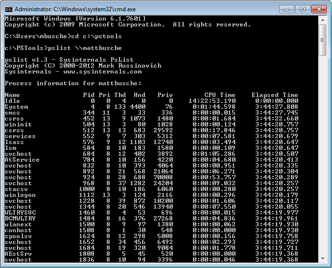

At work, we have a lot of computers/servers that need to be remotely managed. If a computer has frozen for some reason, PS Tools <a />is a great program to help determine what the issue is and if necessary remotely reboot the computer. There are 12 different programs that come with PS Tools, but pslist and pskill are the two used most frequently.

All PS Tools programs are ran via the command line. I unzipped all the programs to c:\pstools, so I can use `cd c:\pstools` in the command prompt to get to my directory from there you can type pslist to get a list of all running processes on a computer.

`pslist \\mattbusche` is the command to find all running processes on my computer

 

Normally if a rogue process is the problem with the computer it will have an extremely high CPU time. Idle and system will always have high times, so those can always be ignored. To kill a process you need the pid from the pslist command. You will need to reference the computer in this command as well `pskill \\mattbusche -t 344`

That command would terminate pid 344 smss. If the offending process isn't something you've heard of, you probably shouldn't just go and kill it. We have a ton of VB programs, so those are fairly easy to identify (i.e. pre-trip approval, email reader, etc.)

If for some reason the process cannot be killed then you will need to use psshutdown which I will cover in a later post.
