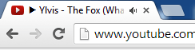

One of internet users biggest annoyances has been resolved in Chrome 33. When a tab starts playing audio Google Chrome version 33 adds a speaker icon to the tab.

 

From all the testing I did, the speaker icon is the last thing to disappear when you have a bunch of tabs, and it works whether you have multiple tabs with audio, if the audio is paused and isn't dependent on your system sound be

ing turned on.
