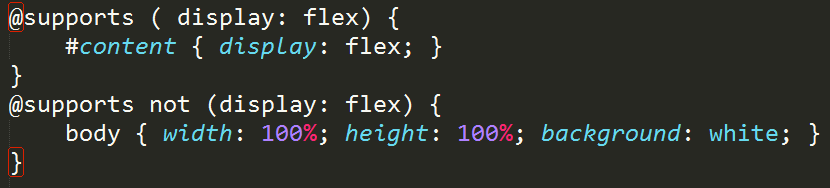
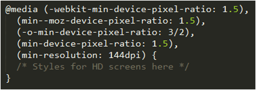
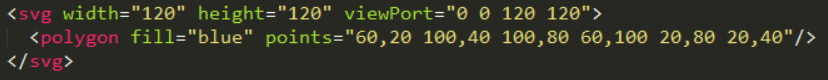
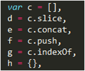

#Responsible Responsive Web Design

Matt Busche

<a href="https://twitter.com/mrbusche" target="_blank">@mrbusche</a>

<a href="http://mrbusche.com/p/iowacodecamp/" target="_blank">mrbusche.com/p/iowacodecamp</a>

#Questions?

##What is it?

- an approach
- provide optimal user experience
- content first!

Note:

- approach to provide optimal viewing experience on all devices
- make the web platform agnostic
- what do your users care about?

##What is it?

- not a separate site
- one codebase
- no context
- <a href="http://m.espn.go.com/nfl/story?storyId=10661193" target="_blank">m.espn</a> <a href="http://m.espn.go.com/general/chat/chat?eventId=51108&wjb" target="_blank">m.espn2</a>
- mobile, desktop, UA sniffer
- SEO, device, orientation

Note:

- no m.espn.com link
- m.espn links redirect <a href="http://m.espn.go.com/nfl/story?storyId=10661193" target="_blank">test link</a>
- m.espn link <a href="http://m.espn.go.com/general/chat/chat?eventId=51108&wjb" target="_blank">test link non insider</a>
- mobile, desktop and user agent sniffer
- SEO
- what device, orientation, browser features

##Why Responsive Design?

##Why Responsive Design?

- 330M smartphones sold in Q2 2015
- 6.2 visits on 2.6 devices

##Why Responsive Design?

- users don't want an app 
  

##Why Responsive Design?

- you have mobile users
- don't have money for apps
- accessible from any device
- SEO matters

##How Does it Work?

- CSS3 spec
- <a href="http://caniuse.com/#feat=css-mediaqueries" target="_blank">media query</a>
- IE 9, FF 3.5, Chrome 2
- 96.45% (93.92% in February 2015)
- you can fix <IE8

Note:

- iOS 7, Android 4.4, Blackberry 10.0
- graceful degradation (mostly)
- 87.12% of global users
- non responsive - respond.js IE 5.5, FF 2

##How Does it Work?

- link and @import selectively\* load
- window pixels
  

Note:

- all common browsers will request every stylesheet in an HTML doc
- Safari, Opera and Chrome will evaluate a link's media query to raise/lower priority of that request
- low priority requests won't block page rendering

##How Does it Work?

- foolproofing the viewport
- meta tag not w3c standard
  

Note:

- w3c never standardized meta tag (always seemed odd)

##How Does it Work?

- <a href="nometa" target="_blank">no meta</a> tag; <a href="meta" target="_blank">meta</a>
  

##Layout Process

- identify constraints
- mobile first!
- useful for some, useful for all
- design for touch screen
- decide in the browser

Note:

- Use as many break points as needed
- tables? Quotes? ads?
- 44x44px button, larger when at the bottom (thumb use)

##Mobile First Development

- determine what's important
- progressive enhancement
- can cause issues with <a href="http://m.espn.go.com/general/chat/chat?eventId=51108&wjb" target="_blank">unsupported browsers</a>

Note:

- a mobile-first responsive layout will render in a layout intended for small screens on a desktop computer, usable, but probably not ideal

##Progressive Disclosure

##Progressive Disclosure
 

##Layout Process

##Layout Process
<a href="http://alistapart.com/article/how-we-hold-our-gadgets" target="_blank">How We Hold Our Gadgets</a>

##Supporting the unsupported

- HTML5shiv
- respond.js IE 6+, FF2+
- PIE.js - CSS3 (Prog IE)
- selectivizr - CSS3 pseudo classes

##Determining the unsupported

- mostly IE8 and Opera Mini. Some IE9
- graceful degradation
- media queries
- HTML4 or HTML5

 

Note:

- querySelector - native CSS selecting
- localStorage
- addEventListener - basically means it's better than IE8 for standards support

##Detecting features

- modernizr

 
 
 

##Detecting other features

- <a href="http://caniuse.com/#feat=css-supports-api">@supports</a> 67.86% (non IE)

- user agent detection

Note:

- http://dev.w3.org/csswg/css-conditional/#at-supports

##Progressive Enhancement

- EnhanceJS
- upgrading images for HD screens

##Lang attribute

- no lang then unknown
- accessibility - screen readers
- hyphens
- internationalization (i18n)

 

##Load times

- average page size is <a href="http://httparchive.org/interesting.php" target="_blank">2219KB</a>

  - 63.86% Images (1412 KB)
  - 16.64% Scripts (368)
  - 8.46% Video (187)
  - 5.16% Fonts (114)
  - 3.35% CSS (74)
  - 2.35% HTML (52)
  - 0.18% Other (4)

- most are not responsive

##Why do we care?

- 80% of worldwide users are on 3G or worse

##Why do we care?

##Decreasing image load time

- PNG - decrease # of colors
- JPEG - better encoding
- grunt imagemin - svg and gif
- TinyPNG/TinyJPG
- ImageOptim (mac)
- <a href="http://static.nationwide.com/static/T2_NF_Story_NWbanner-lg-144-157735.jpg?r=43" target="_blank">banner</a> 80.7KB -> 21.4KB

Note:

- can run multiple times on tinyPNG

##Decreasing image load time

- svg images require fallback
- svg is not always better
- <a href="http://caniuse.com/#feat=svg" target="_blank">96.43%</a> support

 

##Decreasing image load time

- svg images
- CSS shapes <a href="http://caniuse.com/#feat=css-shapes" target="_blank">55.99%</a>

<svg width="120" height="120" viewPort="0 0 120 120">
	<polygon fill="blue" points="60,20 100,40 100,80 60,100 20,80 20,40"/>
</svg>

##Decreasing image load time

- <a href="http://boazsender.github.io/datauri/" target="_blank">data uri</a> - <a href="http://caniuse.com/#feat=datauri" target="_blank">97.72%</a> no http request
- ajax load data
- <a href="picture" target="_blank">&#060;picture&#062;</a> one request <a href="http://caniuse.com/#feat=picture" target="_blank">55.47%</a>
- <a href="https://github.com/scottjehl/picturefill" target="_blank">Picturefill</a> (polyfill)

##Grunticon

- grunt.js task
- takes folder of svg/png files
- outputs css; graceful degradation
  - <a href="https://github.com/filamentgroup/grunticon/blob/master/example/output/icons.data.svg.css" target="_blank">svg data url</a>
  - <a href="https://github.com/filamentgroup/grunticon/blob/master/example/output/icons.data.png.css" target="_blank">png data url</a>
  - <a href="https://github.com/filamentgroup/grunticon/blob/master/example/output/icons.fallback.css" target="_blank">png image </a>

##Decreasing CSS load time

- minify files
  - remove comments
- reduce # of files (concat)
- development vs production
- gzip

##Pros and cons of one CSS File

- only one http request
- may send more than you need
- css is redundant; gzip is great

##Decreasing JS load time

- minify files
- reduce # of files (concat)
- development vs production
- minify/gzip better with one file

Note:

- JavaScript minification often goes further, using techniques like renaming variables to use fewer characters (since the variable names themselves don't need to make sense to a computer)

##Decreasing JS load time

- obfuscation

 
 

##Enabling Gzip

- .htaccess file
- http://checkgzipcompression.com/

##Load times using basic tips

- 60% savings on images, JS, CSS
- average page size is 1099KB
- 51% Images (565KB)
- 13% Scripts (147)
- 17% Video (187)
- 10% Fonts (114)
- 3% CSS (30)
- 5% HTML (52)
- .4% Other (4)
- excludes any gzip savings

##Responsive Images

- Responsive <a href="fluid" target="_blank">images</a>

##Responsive videos

- Create box with proper <a href="video" target="_blank">aspect ratio</a>

Note:

- 25px top bezel
- 16:9 ratio

##Page Layout

- CSS in head
- script at end of body
- <a href="https://developers.google.com/speed/pagespeed/insights/" target="_blank">Render blocking content</a>

Note:

- CSS works best when all styles are loaded and parsed before an HTML document is rendered
  conversely, JS is often able to be applied after page elements are loaded

##Perceived Performance

- mobile users have short attention spans
- detecting <a href="http://paul.kinlan.me/detecting-critical-above-the-fold-css/" target="_blank">above the fold</a> css
- there is <a href="http://www.lukew.com/ff/entry.asp?1946" target="_blank">no fold</a>
- lazy load content

##HTTP/2

- Improved Performance - transferred in binary (no translating)
- Multiplexing - multiple concurrently open streams
- Prioritization - determined by the browser
- Compression - headers are redundant
- Built off of SPDY

##HTTP/2

- no more concatenating text files
- no more inlining js or css
- no more sprite images

##HTTP/2

- keep optimizing size
- keep progressive enhancement
- keep avoiding unnecessary http requests

##Auto complete

- Form <a href="form" target="_blank">auto complete</a>

##Service Worker

- <a href="http://caniuse.com/#feat=serviceworkers" target="_blank">46.94%</a> Chrome, Opera and Firefox 44 (42 stable)
- Endpoint is important! (not /js)

##Service Worker

- Promises
- Offline functionality
- Push Notifications
- Background Sync
- Add to Home Screen

## Offline functionality

- chrome://flags "Enable Show Saved Copy Button"
- Cache assets (array for folders/assets)
- Network then cached
- Cached then network

## Push Notifications

- Can be disabled entirely or per site
- <a href="https://simple-push-demo.appspot.com/" target="_blank">Push demo</a>
- <a href="https://www.npmjs.com/package/w3gram" target="_blank">w3gram</a> Chrome 38, Firefox 32, Safari 8
- Websocket API

## Add to Home Screen

- Impression of native app (escapes browser tabs)
- Eligibility criteria evolve over time
- Offline enabled
- Web App Manifest Required (name/icon)
- HTTPS

##Testing

- chrome - dev tools
- network tools
- timeline
- slow connections!
- firefox - ctrl + shift + m

##Testing

- use real devices
- <a href="http://opendevicelab.com/" target="_blank">opendevicelab.com</a>
- <a href="http://www.webpagetest.org/" target="_blank">WebPagetest</a>
- Google <a href="https://developers.google.com/speed/pagespeed/insights/" target="_blank">PageSpeed Insights</a>

##References

- <a href="http://alistapart.com/article/creating-intrinsic-ratios-for-video" target="_blank">Creating Intrinsic Ratios for Video</a>
- <a href="https://sathyalog.wordpress.com/2015/03/03/http2-the-rocket-booster-of-http/" target="_blank">HTTP/2</a>
- <a href="https://ponyfoo.com/articles/serviceworker-revolution" target="_blank">Service Worker</a>
- <a href="http://alistapart.com/article/how-we-hold-our-gadgets" target="_blank">How We Hold Our Gadgets</a>
- <a href="https://www.filamentgroup.com/lab/delivering-responsibly.html" target="_blank">Scott Jehl - Delivering Responsibly</a>
- <a href="http://www.ericsson.com/res/docs/2014/ericsson-mobility-report-november-2014.pdf" target="_blank">Ericsson Mobility Report</a>
- <a href="https://whatdoesmysitecost.com/" target="_blank">What Does My Site Cost?s</a>

##Resources

- <a href="https://developer.mozilla.org/en-US/" target="_blank">Mozilla Developer Network (MDN)</a>
- <a href="http://designingforperformance.com/index.html" target="_blank">Designing for Performance</a> Lara Hogan
- <a href="http://www.abookapart.com/products/responsive-web-design" target="_blank">Responsive Web Design</a>
- <a href="http://abookapart.com/products/responsible-responsive-design" target="_blank">Responsible Responsive Design</a>
- <a href="http://responsivewebdesign.com/podcast/" target="_blank">Responsive Web Design Podcast</a>
- <a href="http://alistapart.com/" target="_blank">A List Apart</a>
- <a href="http://www.filamentgroup.com/" target="_blank">Filament Group</a>

# Questions?
