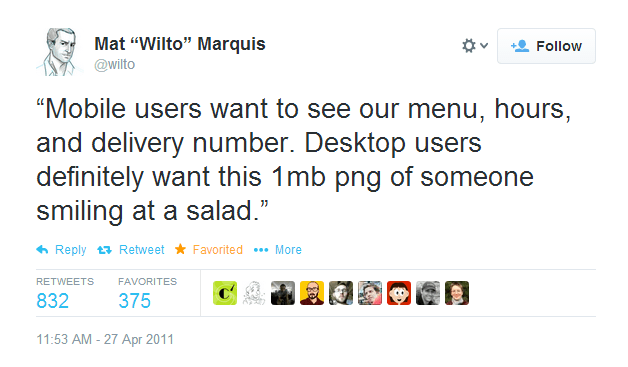
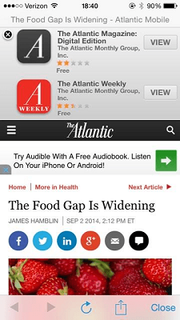

# Getting started with Responsive Web Design

Matt Busche

@mrbusche

matthewbusche.com/p/responsive-NCDevCon

# What is it?

* an approach
* provide optimal user experience
* content first!

Note:
- approach to provide optimal viewing experience on all devices
- make the web platform agnostic
- what do your users care about?

 
<a href="https://twitter.com/wilto/statuses/63284673723375616">Mat "Wilto" Marquis</a>

# What is it?
* not a <a href="http://m.espn.go.com/nfl/story?storyId=10661193" target="_blank">separate</a> <a href="http://m.espn.go.com/general/chat/chat?eventId=51108&wjb">site</a>
* one codebase
* no context

Note:
- no m.espn.com link
- m.espn links redirect <a href="http://m.espn.go.com/nfl/story?storyId=10661193" target="_blank">test link</a>
- m.espn link <a href="http://m.espn.go.com/general/chat/chat?eventId=51108&wjb">test link non insider</a>
- mobile, desktop and user agent sniffer
- SEO
- what device, orientation, browser features

## Misconceptions
* they all look the same
* expensive
* responsive design is bad for fonts
* makes apps obsolete

Note:
- twitter bootstrap
- em vs rem vs px
- push notifications, camera, GPS
- apps can be used offline
- more on apps later

## When is it appropriate?

* users don't want an app 

## When is it appropriate?

* you have mobile users
* don't have money for apps
* if SEO matters

Note:
- phone and tablet are mobile
- 28% mobile traffic 1/3 tablet, 2/3 phone
- apple, android, microsoft, blackberry
- 250M smartphones sold in Q3 2013

## Pros of a framework
* Boilerplate
* grids
* dev time

Note:
- foundation
- bootstrap
- skeleton
- gumby

## Cons of a framework
* research time
* load times
	* foundation 6372 lines 140kb compressed
	* gumby 1683 lines 136kb compressed
	* bootstrap 6000 lines 98kb compressed
	* skeleton 568 lines 12kb compressed

# How Does it Work?
* CSS3 spec
* <a href="http://caniuse.com/#feat=css-mediaqueries" target="_blank">media query</a>
* IE 9, FF 3.5, Chrome 2, Safari 4.0, Opera 9.5
* iOS 3.2, Android 2.1, Blackberry 7.0
* you can fix <IE8

Note:
- IE 11, FF 28, Chrome 33, Safari 7.0, Opera 19.0
- iOS 7, Android 4.4, Blackberry 10.0
- graceful degradation (mostly)
- 87.12% of global users
- non responsive - respond.js IE 5.5, FF 2

## How Does it Work?

	<link rel="stylesheet" type="text/css" media="screen" href="screen.css">
	<link rel="stylesheet" type="text/css" media="print" href="print.css">

## How Does it Work?

Link:

	<link media="only screen and (max-width: 768px)" href="css/tablet.css" rel="stylesheet">

@import:

	@import url(mobile.css) (max-width:479px);

inline:

	@media only screen and (max-width: 959px) {
		/* Smaller than standard 960 (devices and browsers) */
	}

Note:
- Link and import only loads related css for current screen size
- best practice (mentioned later)

## How Does it Work?

	pre { white-space: pre-wrap; font-family: "Courier New", Courier, monospace; }
	body { background: yellow; }
	@media only screen and (min-width: 768px) and (max-width: 959px) {
		/* Tablet Portrait size to standard 960 (devices and browsers) */
		body { background: #87CEFA; }//light blue
	}

	@media only screen and (max-width: 767px) {
		/* All Mobile Sizes (devices and browser) */
		body { background: red; }
		pre { font-family: "Times New Roman", Times, serif; }
	}

	@media only screen and (min-width: 480px) and (max-width: 767px) {
		/* Mobile Landscape Size to Tablet Portrait (devices and browsers) */
		body { background: green; }
	}

	@media only screen and (max-width: 479px) {
		/* Mobile Portrait Size to Mobile Landscape Size (devices and browsers) */
		body { background: orange; }
		pre { font-family: "Courier New", Courier, monospace; }
	}

<a href="demo1/index.html" target="_blank">Demo</a>

Note:
- demo browser color change only

## Layout process

* determine breakpoints
* content inventory
* identify constraints
* sketch out your design

Note:
- Use as many break points as needed
- tables? Quotes? ads?
- footable helps with tables

## Basic Responsive Design Structure
* max-width applied if window is equal to or less than
* min-width applied if window is equal to or greater than

		.container { position: relative; width: 960px; margin: 0 auto; padding: 0; }
		/* Default for everything */
		@media only screen and (max-width: 959px) {
			/* Smaller than standard 960 (devices and browsers) */
		}
		@media only screen and (min-width: 768px) and (max-width: 959px) {
			/* Tablet Portrait size to standard 960 (devices and browsers) */
		}
		@media only screen and (max-width: 767px) {
			/* All Mobile Sizes (devices and browser) */
		}
		@media only screen and (min-width: 480px) and (max-width: 767px) {
			/* Mobile Landscape Size to Tablet Portrait (devices and browsers) */
		}
		@media only screen and (max-width: 479px) {
			/* Mobile Portrait Size to Mobile Landscape Size (devices and browsers) */
		}

Note:
- WINDOW pixels
- set your OWN breakpoints
- sizes are arbitrary
- tablet is not always tablet

## Basic Responsive Design Structure

	pre { white-space: pre-wrap; font-family: "Courier New", Courier, monospace; }
	body { background: yellow; }
	@media only screen and (min-width: 768px) and (max-width: 959px) {
		/* Tablet Portrait size to standard 960 (devices and browsers) */
		body { background: #87CEFA; }//light blue
	}

	@media only screen and (max-width: 767px) {
		/* All Mobile Sizes (devices and browser) */
		body { background: red; }
		pre { font-family: "Times New Roman", Times, serif; }
	}

	@media only screen and (min-width: 480px) and (max-width: 767px) {
		/* Mobile Landscape Size to Tablet Portrait (devices and browsers) */
		body { background: green; }
	}

	@media only screen and (max-width: 479px) {
		/* Mobile Portrait Size to Mobile Landscape Size (devices and browsers) */
		body { background: orange; }
		pre { font-family: "Courier New", Courier, monospace; }
	}

<a href="demo1/index.html" target="_blank">Demo</a> 

Note:
- This does NOT have the viewport

## Basic Responsive Design Structure

	<meta name="viewport" content="width=device-width, initial-scale=1">
	

		

			<h3>View your Responsive Design Account (grid_4)</h3>
		

		

			<h3>Welcome to our website! Use the left nav (grid_12)</h3>
		

	

<a href="demofixedbadnested/index.html" target="_blank">Demo</a> 

Note:
- no column, alpha or omega
- no different than regular css

## Basic Responsive Design Structure

	.container .column { float: left; display: inline; margin-left: 10px; margin-right: 10px; }
	.alpha { margin-left: 10px; }
	.omega { margin-right: 10px; }

	<meta name="viewport" content="width=device-width, initial-scale=1">

	

		

			

				<h3>View your Responsive Design Account (grid_4)</h3>
			

		

		

			

				<h3>Welcome to our website! Use the left nav (grid_12)</h3>
			

		

	

<a href="demofixed/index.html" target="_blank">Demo</a>

Note:
- has viewport

## Fixed Design

	.container { position: relative; width: 960px; margin: 0 auto; padding: 0; }
	/* Base Grid */
	.container .grid_1  { width: 40px;  }
	.container .grid_2  { width: 100px; }
	.container .grid_3  { width: 160px; }
	.container .grid_4  { width: 220px; }
	.container .grid_5  { width: 280px; }
	.container .grid_6  { width: 340px; }
	.container .grid_7  { width: 400px; }
	.container .grid_8  { width: 460px; }
	.container .grid_9  { width: 520px; }
	.container .grid_10 { width: 580px; }
	.container .grid_11 { width: 640px; }
	.container .grid_12 { width: 700px; }
	.container .grid_13 { width: 760px; }
	.container .grid_14 { width: 820px; }
	.container .grid_15 { width: 880px; }
	.container .grid_16 { width: 940px; }

<a href="fixed/index.html" target="_blank">Demo</a>

## Why Fixed Design?
* easy to create
* easy to maintain
* 70% of users

## Why not fixed Design?
* doesn't scale
<!-- * excessive whitespace -->
* low usability
* forgetting 30% of users

Note:
- mobile users have to zoom

## Fluid Design
* responsive design
* pixels
* percentages
* both

##Pixel based - base

	.container { position: relative; width: 960px; margin: 0 auto; padding: 0; }
	/* Base Grid */
	.container .grid_1  { width: 40px;  }
	.container .grid_2  { width: 100px; }
	.container .grid_3  { width: 160px; }
	.container .grid_4  { width: 220px; }
	.container .grid_5  { width: 280px; }
	.container .grid_6  { width: 340px; }
	.container .grid_7  { width: 400px; }
	.container .grid_8  { width: 460px; }
	.container .grid_9  { width: 520px; }
	.container .grid_10 { width: 580px; }
	.container .grid_11 { width: 640px; }
	.container .grid_12 { width: 700px; }
	.container .grid_13 { width: 760px; }
	.container .grid_14 { width: 820px; }
	.container .grid_15 { width: 880px; }
	.container .grid_16 { width: 940px; }

Note:
- set pixel sizes

##Pixel based - tablet

	@media only screen and (min-width: 768px) and (max-width: 959px) {
		.container .grid_1  { width: 28px;  }
		.container .grid_2  { width: 76px;  }
		.container .grid_3  { width: 124px; }
		.container .grid_4  { width: 172px; }
		.container .grid_5  { width: 220px; }
		.container .grid_6  { width: 268px; }
		.container .grid_7  { width: 316px; }
		.container .grid_8  { width: 364px; }
		.container .grid_9  { width: 412px; }
		.container .grid_10 { width: 460px; }
		.container .grid_11 { width: 508px; }
		.container .grid_12 { width: 556px; }
		.container .grid_13 { width: 604px; }
		.container .grid_14 { width: 652px; }
		.container .grid_15 { width: 700px; }
		.container .grid_16 { width: 748px; }
		/* any other style to apply to tablet only */
	}

##Pixel based - large mobile

	/* Large Mobile */
	@media only screen and (min-width: 480px) and (max-width: 767px) {
		.container .grid_1,
		.container .grid_2,
		.container .grid_3,
		.container .grid_4,
		.container .grid_5,
		.container .grid_6,
		.container .grid_7,
		.container .grid_8,
		.container .grid_9,
		.container .grid_10,
		.container .grid_11,
		.container .grid_12,
		.container .grid_13,
		.container .grid_14,
		.container .grid_15,
		.container .grid_16 { width: 420px; }
	}

##Pixel based - small mobile

	/* Small Mobile */
	@media only screen and (max-width: 479px) {
		.container .grid_1,
		.container .grid_2,
		.container .grid_3,
		.container .grid_4,
		.container .grid_5,
		.container .grid_6,
		.container .grid_7,
		.container .grid_8,
		.container .grid_9,
		.container .grid_10,
		.container .grid_11,
		.container .grid_12,
		.container .grid_13,
		.container .grid_14,
		.container .grid_15,
		.container .grid_16 { width: 300px; }
	}

<a href="demofixed/index.html" target="_blank">Demo</a>

Note:
- set pixel sizes
- tablet and mobile are not always tablet and mobile

## Percentage based
* target / context x 100 = percentage

		/* Base */
		.alpha { margin-left: 1.041666666666%; } /* 10/960 */
		.omega { margin-right: 1.041666666666%; } /* 10/960 */

		/* Tablet */
		.alpha { margin-left: 1.30208333333333%; } /* 10/768 */
		.omega { margin-right: 1.30208333333333%; } /* 10/768 */

## Percentage based - Base

	.container { position: relative; width: 100%; margin: 0 auto; padding: 0; }/* 960/960 */
	/* Base Grid */
	.container .grid_1  { width:  4.1666666666667%; } /* 40/960 */
	.container .grid_2  { width: 10.4166666666667%; } /* 100/960 */
	.container .grid_3  { width: 16.6666666666667%; } /* 160/960 */
	.container .grid_4  { width: 22.9166666666667%; } /* 220/960 */
	.container .grid_5  { width: 29.1666666666667%; } /* 280/960 */
	.container .grid_6  { width: 35.4166666666667%; } /* 340/960 */
	.container .grid_7  { width: 41.6666666666667%; } /* 400/960 */
	.container .grid_8  { width: 47.9166666666667%; } /* 460/960 */
	.container .grid_9  { width: 54.1666666666667%; } /* 520/960 */
	.container .grid_10 { width: 60.4166666666667%; } /* 580/960 */
	.container .grid_11 { width: 66.6666666666667%; } /* 640/960 */
	.container .grid_12 { width: 72.9166666666667%; } /* 700/960 */
	.container .grid_13 { width: 79.1666666666667%; } /* 760/960 */
	.container .grid_14 { width: 85.4166666666667%; } /* 820/960 */
	.container .grid_15 { width: 91.6666666666667%; } /* 880/960 */
	.container .grid_16 { width: 97.9166666666667%; } /* 940/960 */

## Percentage based - Tablet

	/* Tablet */
	@media only screen and (min-width: 768px) and (max-width: 959px) {
		.container .grid_1  { width: 3.6458333333333%; } /* 28/768 */
		.container .grid_2  { width: 9.8958333333333%; } /* 76/768 */
		.container .grid_3  { width: 16.145833333333%; } /* 124/768 */
		.container .grid_4  { width: 22.395583333333%; } /* 172/768 */
		.container .grid_5  { width: 28.645833333333%; } /* 220/768 */
		.container .grid_6  { width: 34.895833333333%; } /* 268/768 */
		.container .grid_7  { width: 41.145833333333%; } /* 316/768 */
		.container .grid_8  { width: 47.395833333333%; } /* 364/768 */
		.container .grid_9  { width: 53.645833333333%; } /* 412/768 */
		.container .grid_10 { width: 59.895833333333%; } /* 460/768 */
		.container .grid_11 { width: 66.145833333333%; } /* 508/768 */
		.container .grid_12 { width: 72.395833333333%; } /* 556/768 */
		.container .grid_13 { width: 78.645833333333%; } /* 604/768 */
		.container .grid_14 { width: 84.895833333333%; } /* 652/768 */
		.container .grid_15 { width: 91.145833333333%; } /* 700/768 */
		.container .grid_16 { width: 97.395833333333%; } /* 748/768 */
	}

## Percentage based - All Mobile

	/* All Mobile */
	@media only screen and (max-width: 767px){
		.container .grid_1,
		.container .grid_2,
		.container .grid_3,
		.container .grid_4,
		.container .grid_5,
		.container .grid_6,
		.container .grid_7,
		.container .grid_8,
		.container .grid_9,
		.container .grid_10,
		.container .grid_11,
		.container .grid_12,
		.container .grid_13,
		.container .grid_14,
		.container .grid_15,
		.container .grid_16  { width: 100%; }
	}

<a href="demofluid/index.html" target="_blank">Demo</a>

## Pixel and percentage based
	.container { position: relative; max-width: 1200px; margin: 0 auto; padding: 0; }

<a href="demofixedfluid/index.html" target="_blank">Demo</a>

## Flexible Images

	

<a href="demoimage/index.html" target="_blank">Demo</a>

Note:
- not 2 images not 2 requests to server

## Flexible Videos
* FitVids
* <a href="fitvid/index.html" target="_blank">Demo</a>

Note:
- supports youtube and vimeo natively
- can add your own video vendor

## Testing responsive design
* chrome
* firefox
* http://mattkersley.com/responsive/
* http://quirktools.com/screenfly/
* device testing

# Chrome
* 640 px window size
* open <a href="chromedevtools.png" target="_blank">developer tools</a>
* seems to change with every release

#Firefox
* Ctrl + Shift + M

## Device Testing
* best option
* use your analytics!

## Best Practices
* start with mobile
* progressive enhancement
* optimatization
* inside out release
* don't hide information

Note:
- What really matters? Don't hide info
- load css based on media query - link or import
- incremental design must work from the inside out

## Who is using it?
- <a href="ala/index.html" target="_blank">A List Apart</a>
- <a href="bg/index.html" target="_blank">Boston Globe</a>
- <a href="jj/index.html" target="_blank">Jimmy Johns</a>
- <a href="time/index.html" target="_blank">Time</a>

## Resources
- <a href="http://www.abookapart.com/products/responsive-web-design">A List Apart book</a>
- <a href="http://getbootstrap.com/">Bootstrap</a>
- <a href="http://www.getskeleton.com/">Skeleton</a>
- <a href="http://foundation.zurb.com/">Foundation</a>
- <a href="http://fitvidsjs.com/">FitVid</a>
- <a href="http://revealjs.com/">reveal.js</a>
- <a href="https://github.com/scottjehl/Respond">Respond.js</a>

# Questions?