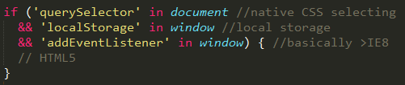
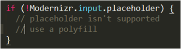

#Responsible Responsive Web Design

Matt Busche

<a href="https://twitter.com/mrbusche" target="_blank">@mrbusche</a>

<a href="http://matthewbusche.com/p/rrwd/" target="_blank">matthewbusche.com/p/rrwd</a>

#Questions?

##What is it?
* an approach
* provide optimal user experience
* content first!

Note:
- approach to provide optimal viewing experience on all devices
- make the web platform agnostic
- what do your users care about?

##What is it?
* not a separate site
* one codebase
* no context
* <a href="http://m.espn.go.com/nfl/story?storyId=10661193" target="_blank">m.espn</a> <a href="http://m.espn.go.com/general/chat/chat?eventId=51108&wjb" target="_blank">m.espn2</a>
* mobile, desktop, UA sniffer
* SEO, device, orientation

Note:
- no m.espn.com link
- m.espn links redirect <a href="http://m.espn.go.com/nfl/story?storyId=10661193" target="_blank">test link</a>
- m.espn link <a href="http://m.espn.go.com/general/chat/chat?eventId=51108&wjb" target="_blank">test link non insider</a>
- mobile, desktop and user agent sniffer
- SEO
- what device, orientation, browser features

##Why Responsive Design?
* users don't want an app 

##Why Responsive Design?
* you have mobile users
* don't have money for apps
* accessible from any device
* SEO matters

Note:
- phone and tablet are mobile
- 28% mobile traffic 1/3 tablet, 2/3 phone
- apple, android, microsoft, blackberry
- 250M smartphones sold in Q3 2013

##How Does it Work?
* CSS3 spec
* <a href="http://caniuse.com/#feat=css-mediaqueries" target="_blank">media query</a>
* IE 9, FF 3.5, Chrome 2
* 94.73% (93.92% in February)
* you can fix <IE8

Note:
- iOS 7, Android 4.4, Blackberry 10.0
- graceful degradation (mostly)
- 87.12% of global users
- non responsive - respond.js IE 5.5, FF 2

##How Does it Work?
* link and @import selectively* load
* window pixels

Note:
- all common browsers will request every stylesheet in an HTML doc
- Safari, Opera and Chrome will evaluate a link's media query to raise/lower priority of that request
- low priority requests won't block page rendering

##How Does it Work?
* foolproofing the viewport
* meta tag not w3c standard

Note:
- w3c never standardized meta tag (always seemed odd)

##How Does it Work?
* <a href="nometa" target="_blank">no meta</a> tag; <a href="meta" target="_blank">meta</a>

##Layout Process
* identify constraints
* mobile first!
* useful for some, useful for all
* design for touch screen

Note:
- Use as many break points as needed
- tables? Quotes? ads?
- 44x44px button, larger when at the bottom (thumb use)

##Layout Process

##Layout Process
* identifying breakpoints
* progressive disclosure

Note:
- start with a small screen and expand until it looks bad, time for a breakpoint

##Progressive Disclosure
 

##Mobile First Development
* can cause issues with unsupported browsers
* determine what's important
* progressive enhancement

Note:
- a mobile-first responsive layout will render in a layout intended for small screens on a desktop computer, usable, but probably not ideal

##Supporting the unsupported
* HTML5shiv
* respond.js IE 6+, FF2+
* PIE.js - CSS3 (Prog IE)
* selectivizr - CSS3 pseudo classes

##Determining the unsupported
* graceful degradation
* media queries
* HTML4 or HTML5

 

Note:
- querySelector - native CSS selecting
- localStorage
- addEventListener - basically means it's better than IE8 for standards support

##Detecting features
* modernizr

 
 
 

##Detecting other features
* @supports

* user agent detection

Note:
- http://dev.w3.org/csswg/css-conditional/#at-supports

##Progressive Enhancement
* EnhanceJS
* upgrading images for HD screens

##Lang attribute
* no lang then unknown
* accessibility - screen readers
* hyphens
* internationalization (i18n)

 

##Load times
* average page size is <a href="http://httparchive.org/interesting.php" target="_blank">2.061MB</a>
	* 63% Images (1297 KB)
	* 15% JavaScript (318)
	* 7% Other (152)
	* 5% Fonts (93)
	* 3% CSS (61)
	* 3% HTML (61)
* most are not responsive

##Decreasing image load time
* PNG - decrease # of colors
* JPEG - better encoding
* grunt imagemin - svg and gif
* TinyPNG/TinyJPG
* ImageOptim (mac)
* <a href="http://static.nationwide.com/static/T2_NF_Story_NWbanner-lg-144-157735.jpg?r=43" target="_blank">banner</a> 80.7KB -> 21.4KB

Note:
- can run multiple times on tinyPNG

##Decreasing image load time
* svg images require fallback
* svg is not always better
* <a href="http://caniuse.com/#feat=svg" target="_blank">94.71%</a> support

 

##Decreasing image load time
* svg images
* CSS shapes <a href="http://caniuse.com/#feat=css-shapes" target="_blank">50.89%</a>

 

##Decreasing image load time
* <a href="http://boazsender.github.io/datauri/" target="_blank">data uri</a> - <a href="http://caniuse.com/#feat=datauri" target="_blank">96.99%</a>
* ajax load data
* <a href="picture" target="_blank">&#060;picture&#062;</a> one request <a href="http://caniuse.com/#feat=picture" target="_blank">45.62%</a>
* <a href="https://github.com/scottjehl/picturefill" target="_blank">Picturefill</a> (polyfill)

##Grunticon
* grunt.js task
* takes folder of svg/png files
* outputs css; graceful degradation
	* <a href="https://github.com/filamentgroup/grunticon/blob/master/example/output/icons.data.svg.css" target="_blank">svg data url</a>
	* <a href="https://github.com/filamentgroup/grunticon/blob/master/example/output/icons.data.png.css" target="_blank">png data url</a>
	* <a href="https://github.com/filamentgroup/grunticon/blob/master/example/output/icons.fallback.css" target="_blank">png image </a>

##Decreasing CSS load time
* minify files
	* remove comments
* reduce # of files (concat)
* development vs gzip
* production

##Pros and cons of one CSS File
* only one http request
* may send more than you need
* css is redundant; gzip is great

##Decreasing JS load time
* minify files
* reduce # of files (concat)
* development vs production
* minify/gzip better with one file

Note:
- JavaScript minification often goes further, using techniques like renaming variables to use fewer characters (since the variable names themselves don't need to make sense to a computer)

##Decreasing JS load time
* obfuscation

 
 

##Enabling Gzip
* .htaccess file
* http://checkgzipcompression.com/

##Load times using basic tips
* 60% savings on images, JS, CSS
* average page size is .941MB
	* 55% Images (519 KB)
	* 23% Other (212)
	* 14% JavaScript (127)
	* 3% CSS (24)
	* 6% HTML (59)
* excludes (potential) gzip savings

##Fluid Images
* Fluid <a href="fluid" target="_blank">images</a>

##Fluid videos
* Works the same as images if HTML5
* <a href="http://fitvidsjs.com/" target="_blank">FitVids.js</a> for non HTML5

##Page Layout
* CSS in head
* script at end of body
* <a href="https://developers.google.com/speed/pagespeed/insights/" target="_blank">Render blocking content</a>

Note:
- CSS works best when all styles are loaded and parsed before an HTML document is rendered
conversely, JS is often able to be applied after page elements are loaded

##Perceived Performance
* mobile users have short attention spans
* detecting <a href="http://paul.kinlan.me/detecting-critical-above-the-fold-css/" target="_blank">above the fold</a> css
* lazy load content

##Testing
* chrome - dev tools
* network tools
* timeline
* slow connections!
* firefox - ctrl + shift + m

##Testing
* use real devices
* <a href="http://opendevicelab.com/" target="_blank">opendevicelab.com</a>
* <a href="http://www.webpagetest.org/" target="_blank">WebPagetest</a>
* Google <a href="https://developers.google.com/speed/pagespeed/insights/" target="_blank">PageSpeed Insights</a>

##Resources
* <a href="http://www.abookapart.com/products/responsive-web-design" target="_blank">Responsive Web Design</a>
* <a href="http://abookapart.com/products/responsible-responsive-design" target="_blank">Responsible Responsive Design</a>
* <a href="http://alistapart.com/" target="_blank">A List Apart</a>
* <a href="http://www.filamentgroup.com/" target="_blank">Filament Group</a>

# Questions?